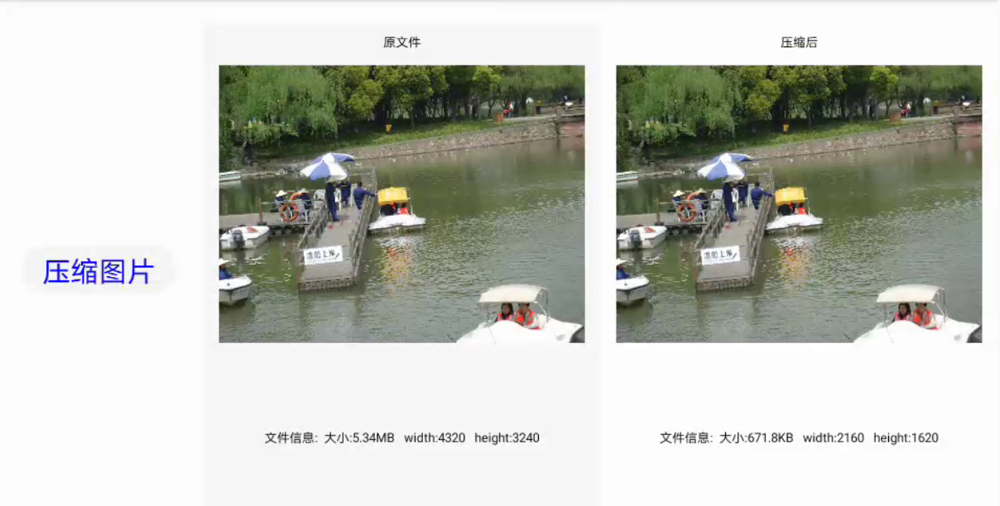
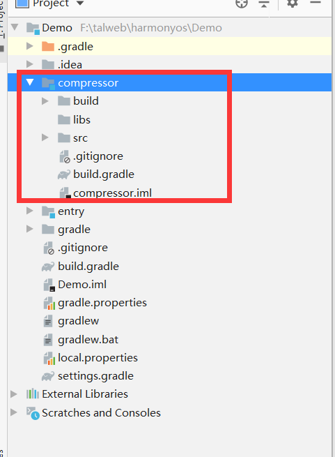
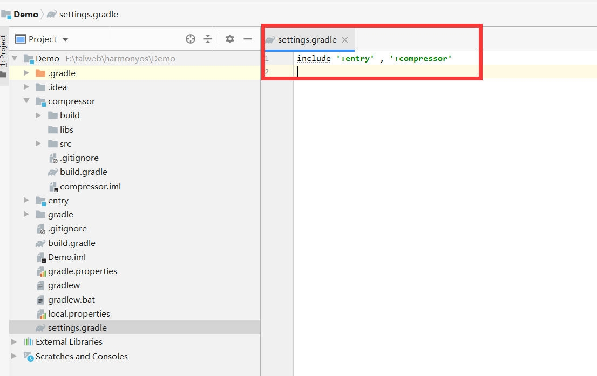
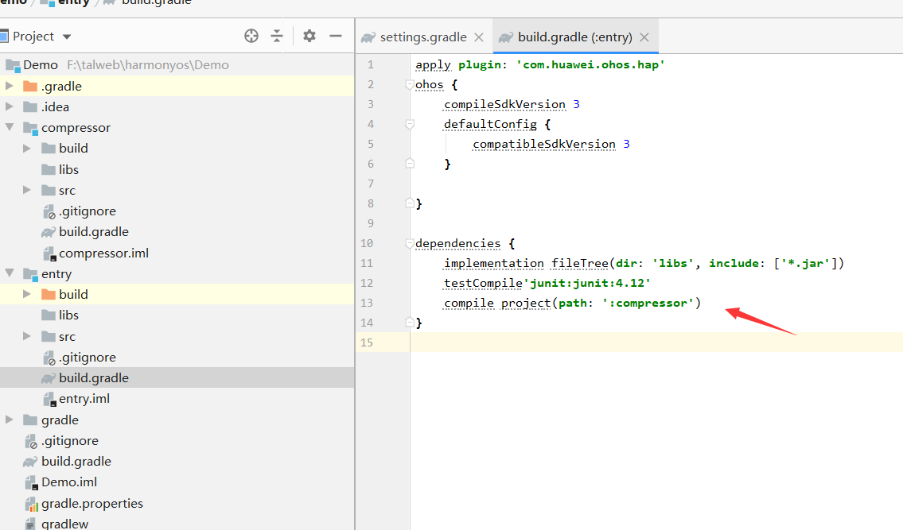

# HiCompressor

将您照片压缩为小尺寸的照片或减少图像的量,损失可以忽略不计

项目参考https://github.com/zetbaitsu/Compressor.git  在使用上尽可能保持一致,kotlin语法改为java语法




## 使用步骤(Setup)

### 下载源码(Download)

```
 复制library模块(compressor) 新项目根目录下  copy module(compressor) to your project
```



### 引用至项目

```
1. 修改项目文件 settings.gradle 添加module致项目:
	include ':entry', ':compressor'
2. 添加引用 修改文件 entry/build.gradle :
	在dependencies节点添加引用:
	compile project(path: ':compressor')
```






### 使用示例

```java
	/**
     * 压缩图片
     */
    public void compressor() {
        try {
            // 从rawfile资源目录获取源文件,可从其他目录中获取
            File srcFile = HiFileUtils.opendRawFile(this, "1.jpg");
            
            //根据参数压缩后返回文件
            // destFile 生成的为缓存目录文件,重新安装或使用清理工具会清除当前文件
            // 如需要请自行保存
            File destFile = HiCompressor.getInstance()
                    .compressor(this, srcFile) //原图片文件
                    .resolution(0.5f) //等比缩放
                    // .resolution(360,250) //图片大小
                    // .rotateDegrees(45) //旋转度
                    .quality(80) //质量
                    .size(2 * 1024 * 1024) //缩放到文件大小
                    .build();

            //文件转为pixelMap
            PixelMap pixelMap = HiFileUtils.fileToPixelMap(destFile);
            ImageInfo imageInfo = pixelMap.getImageInfo();
            
            //压缩后的文件信息
            String msg = String.format("文件信息:  大小:%s   width:%s   height:%s",
                    HiFileUtils.getReadableFileSize(destFile.length()),
                    imageInfo.size.width,
                    imageInfo.size.height
            );
            System.out.println(msg);
        } catch (Exception e) {
            e.printStackTrace();
            String msg = String.format("文件信息:  压缩失败:%s",
                    e.getMessage()
            );
            System.out.println(msg);
            return;
        }
    }
```


### 与原库功能对比 (contrast)

| 功能                        | HiCompressor | Compressor |
| --------------------------- | ------------ | ---------- |
| resolution 缩放             | 支持         | 支持       |
| quality 质量                | 支持         | 支持       |
| format  webp格式            | 不支持       | 支持       |
| size 大小                   | 支持         | 支持       |
| destination 另存为          | 不支持       | 支持       |
| rotateDegrees  旋转图片支持 | 支持         | 不支持     |